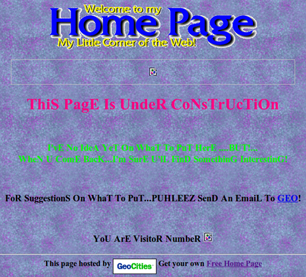
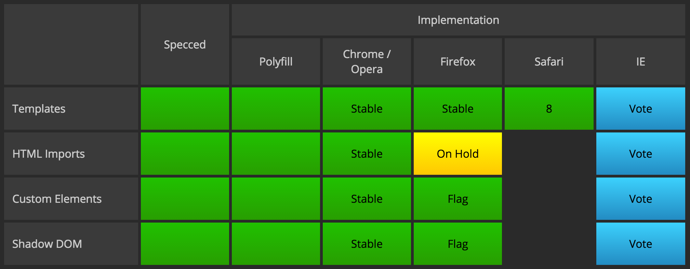

---

layout: default

style: |

  .slide p {
    margin-bottom: 24px;
  }

  .slide h3 {
    font-size: 30px;
    font-weight: bold;
  }

  .slide blockquote cite {
    font-weight: 700;
  }

  .slide table th,
  .slide table td {
    background: none;
  }

  .slide pre code {
    background-color: #efefef;
    padding: 0.5em;
    line-height: 1.5em;
    font-sizeL 20px;
  }

  .no-title h2 {
    display: none;
  }

  .two-codes table td {
    width: 50%;
  }

---

# Component development in CSS

*by [Varya Stepanova](http://varya.me/) from [SC5 Online](http://sc5.io/)*

## Me
{: .no-title }

### Now
Senior Frontend Develover for SC5 Online

### Before
TMG (Amsterdam, the Netherlands); Yandex (Moscow, Russia)

###Area of expertise
Components in web: libraries, SGDD, BEM. Techs: CSS, JavaScript, etc.

## Spoiler

You will learn:

TODO: List

## CSS

> *Cascading Style Sheets* (CSS) is a style sheet language used for describing the look and formatting of a document
> written in a markup language. <cite>[Wikipedia](https://en.wikipedia.org/wiki/Cascading_Style_Sheets)</cite>

First published in 1996
{: .note}

<!-- CSS was designed to enable the separation of document content from document presentation. The specification was
first published in 1996. -->

## Industry challenges
{: .no-title }

<!-- Not your cat's homepage -->

## Bulletproof Web Desing
{: .bulletproof .no-title }

<!-- First place which I know where the industry needs were explained and requirements to the resultant product were
given is a book "Bulletproof Web Desing" by Dan Cederholm. It was first published in 2005 which is quite long ago for
such a rapid evolving inductry.

The idea is that HTML/CSS markup is not created once and forever. By 2005 industry needed it to be stable and
mantainable. -->

##Is this good?

    H1 { color: blue }
    P EM { font-weight: bold }
    A:link IMG { border: 2px solid blue }
    A:visited IMG { border: 2px solid red }
    A:active IMG { border: 2px solid lime }

<!-- CSS was created to make text bold and links underlined. It ideally suited
solving these problems. In many websites developers still use CSS like.

Actually this code from [CSS level 1 specification](http://www.w3.org/TR/CSS1/). It is
very simple, was recommended in 1996. Time passed and we met new chalenges.

Writing CSS is easy. It is very easy to read and it is very likely that you can
find the tricks you need at Stackoverflow. But architechting CSS is very difficult.

-->

## Big CSS

* massive sites
* big teams of developers
* heavy UI
* long running projects

<!-- Explain every point with examples -->

## What makes CSS hard?

* …Vertical centring
* …Equal height columns
* …Browser inconsistencies
* …Unobvious tricks

<!-- All those things can be googled -->

## What are the real hard problems in CSS?

* Scoping
* Specificity conflicts
* Non-deterministic matches
* Dependency management
* Removing unused code

## CSS has no scoping

    a { /* Affects all the links */
      color: red;
    }
    ul li a { /* Affects all the links in lists */
      color: green;
    }

<!-- This especially maters if you link third-party CSS -->

## Specificity

> Specificity is the means by which a browser decides which property values are the most relevant to an element and gets
> to be applied. Specificity is only based on the matching rules which are composed of selectors of different sorts.

## The most specific matters

    

      Text
    

<separator/>

    div#test span { color: green }
    span { color: red }
    div span { color: blue }

## How to overwrite?

    .sidebar { /* Does not work?! */
      float: right;
    }

<separator/>

    body .sidebar {
      float: right;
    }
{: .next }

## Specificity hell
{: .no-title }

    .navbar-inverse .navbar-nav>li>a {
      color: #999;
    }

    #home-menu-container #home-menu li a {
      color: red;
    }

    body #home-menu ul li a {
      color: blue !important;
    }

<!-- People ask on Stackoverflow how to overwrite Bootsrtap -->
<!-- These things can be in different files -->

##Non-deterministic matches

    #id2 div div {
      float: left;
    }

<!-- This can be matched to anything -->
<!-- You cannot rely on the document structure, because it contantly changes while developing -->
<!-- в момент, когда ты пишешь, ты указываешь признаки нод, на которые сматчится правило, а не точный адрес. смотри:
можно писать адрес «Rettigweg 1, 13187 Berlin", а можно «около Wollankstrasse такая боковая улица с тремя домами, и
там есть такой желтый дом, и там на втором этаже ещё балконы металлические с узорами» -->

## Dependency management

## Removing unused code

## Where CSS is hard?
{: .no-title .hard-css }

<table><thead>

<th markdown="1">

This is not hard in CSS

</th>

<th markdown="1">

This is!

</th>

</thead><tr>

<td markdown="1">

    #sidebar ul li a {
      <mark>color: red;</mark>
      <mark>display: block;</mark>
      <mark>padding: 1em;</mark>
    }

</td>

<td markdown="1">

    <mark>#sidebar ul li a</mark> {
      color: red;
      display: block;
      padding: 1em;
    }

</td>

</tr></table>

*How do we architect encapsulated components?*
{: .next }

<!-- CSS is global -->

## Methodologies
{: .shout }

##OOCSS
{: .shout }

##Nicole Sullivan
{: .nicole }

<!-- She proposed OOP for CSS. This was a little bit naive but this was a first attempt. -->

## SMACSS
{: .shout }

##Jonathan Snook
{: .jonathan }

## BEM
{: .shout }

## Vitaly Harisov
{: .harisov }

## Sergey Berezhnoy
{: .veged }

## BEM eco-system

* <mark>CSS Methodology</mark>
* JavaScript framework
* Template engine
* Building system

## Harry & Nicolas
{: .no-title .harry-nicolas }

### Harry Roberts
{: .harry }

###Nicolas Gallagher
{: .nicolas }

## BEM

* Block
* Element
* Modificator

## BEM
{: .no-title }
* No IDs
* No cascade
* Unique classes

## Interface
{: .no-title .interface }

## Interface of blocks
{: .no-title .interface-blocks }

## Everything is a block
{: .no-title }

    <body class="page">

      

          
          
...

          
...

      

      

          
...

          
...

      

<!-- Blocks are marked with classes in HTML -->

## Why not...?

    <ul id="menu">
      <li>Tab 1</li>
      <li>Tab 2</li>
    <ul>

<separator/>

    #menu {
      /* styles for element */
    }

## No IDs

Someday you will need to repeat the block at the same page

## Elements
{: .elements }

## Elements markup
{: .no-title }

    

      <ul>
          <li class="tabbed-pane--tab">Tab1</li>
          <li class="tabbed-pane--tab">Tab2</li>
      </ul>
      

          ...
      

    

## CSS for an element

    .block {
      /* styles for block */
    }
      .block--element {
        /* styles for element */
      }

## Why not...?

    <ul class="menu">
      <li class="item">Tab 1</li>
      <li class="item">Tab 2</li>
    <ul>

<separator/>

    .menu .item {
      /* styles for element */
    }

## No cascade

Remember about <mark>non-deterministic matches</mark>

## Modified block
{: .no-title .modified-block }

## Modifier

    <ul class="menu menu_footer">
      <li class="menu--item">...</li>
      ...
    </ul>

<separator/>

    .menu_footer {
      font-size: 0.8em;
    }

## CSS for modifier
    .block {
      /* styles for block */
    }
      <mark>.block_modifier</mark> {
        /* styles for modifier */
      }
      .block--element {
        /* styles for element */
      }

## Modified element

## Element's modifier

    <ul class="menu">
      <li class="menu--item">Tab 1</li>
      <li class="menu--item <mark>menu--item_current</mark>">Tab 2</li>
      <li class="menu--item">Tab 3</li>
    </ul>

## CSS for elements' modifier

    .block
      /* styles for block */
    }
      .block--element {
        /* styles for element */
      }
        .block--element_modifier {
          /* styles for modified element
        }
{: .css }

## Why not...?

    <ul class="menu footer">...<ul>

<separator/>

    .menu.footer { /* combined selector */
      font-size: 0.8em;
    }

## Why not...?

    <ul class="menu">
      <li class="menu--item current">Tab 2</li>
    <ul>

<separator/>

    .menu--item.current { /* combined selector */
      background-color: red;
    }

## No overspecific selectors

You would suffer when redefining

## BEM & CSS preprocessors

    .block {
      /* styles for block */
      <mark>&</mark>_modifier {
        /* styles for modifier */
      }
      <mark>&</mark>--element {
        /* styles for element */
      }
    }
{: .css }

## [getbem.com](http://getbem.com/)
{: .shout }

## This is solved

* Scoping
* Specificity conflicts
* Non-deterministic matches
* Dependency management
* Removing unused code

## Web Components
{: .shout }

<!-- More info: https://developer.mozilla.org/en-US/docs/Web/Web_Components -->

## Technologies behind
{: .wc-behind }

* Shadow DOM
* Custom Elements
* HTML Templates
* HTML Imports

## Web Components

* [Navite component](demo/video.html)
* [Custom web component](demo/custom-button.html)
* [Templates](demo/templates.html)
* [HTML import](demo/html-import.html)

<!-- The idea is that you can teach the browser how to deal with your custom components. -->

<!-- So, the CSS now can be scoped -->

## HTML import, library

    <!-- Import element -->
    <link rel="import" href="my-lib/google-map.html">

    <!-- Use element -->
    <google-map lat="37.790" long="-122.390"></google-map>

## Are We Componentized Yet?
{: .componentized }

## Web Components Polyfills
{: .wc-polyfills }

* [WebComponents.org](http://webcomponents.org/)
* [X-Tag](http://www.x-tags.org/)

## Make it work

    <!-- Polyfill Web Components support for older browsers -->
    <mark></mark>

    <!-- Import element -->
    <link rel="import" href="google-map.html">

    <!-- Use element -->
    <google-map lat="37.790" long="-122.390"></google-map>

## Ready-made components

* [Polymer](https://www.polymer-project.org/)
* [Google Web Components](http://googlewebcomponents.github.io/)

## Examples of usage

* [Toolbar](demo/toolbar.html)
* [Google map](demo/google-map.html)

## Style guide driven development

## Summary
